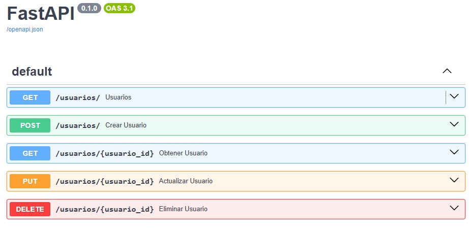
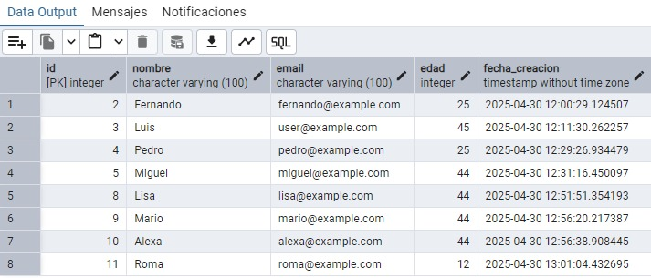
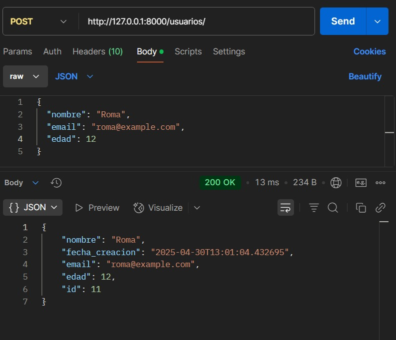

# 🚀 API CRUD con FastAPI + PostgreSQL

Este proyecto es una API RESTful construida con **FastAPI** y **SQLAlchemy**, conectada a una base de datos **PostgreSQL**, que permite realizar operaciones CRUD sobre usuarios.

---

## 🧱 Funcionalidades

- ✅ Crear usuarios (POST)
- ✅ Listar todos los usuarios (GET)
- ✅ Obtener un usuario por ID (GET)
- ✅ Buscar usuarios por nombre (GET con query param)
- ✅ Actualizar datos de un usuario (PUT)
- ✅ Eliminar un usuario (DELETE)
- ✅ Validación de email único
- ✅ Fecha de creación automática

---

## 🧰 Tecnologías usadas

- [FastAPI](https://fastapi.tiangolo.com/)
- [SQLAlchemy](https://www.sqlalchemy.org/)
- [PostgreSQL](https://www.postgresql.org/)
- [Pydantic](https://pydantic.dev/)
- [Uvicorn](https://www.uvicorn.org/)

## 📸 Vistas de la API

### 🔹 1. Documentación interactiva (Swagger UI)

Esta es la vista que ofrece FastAPI automáticamente en `/docs`. Desde aquí puedes probar todos los endpoints de forma visual.

---

### 🔹 2. Registros de la tabla `usuarios`

Aquí se muestra un ejemplo de la respuesta del endpoint `GET /usuarios/`, donde puedes ver los registros de la base de datos en formato JSON.

---

### 🔹 3. Prueba de la API con Postman

Puedes usar Postman para consumir tus endpoints. En este ejemplo se muestra cómo hacer un `POST` a `/usuarios/` con los datos de un nuevo usuario.

